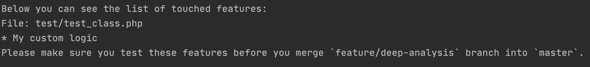

# What touched
This is a small application, which will check/analyse your code and will try to fetch the features, which were touched by your changes. These results can be used during the manual testing of your product.

## How it works
You define the path where application need to check the files. It goes through all files in the path and tries to find the `@featureType` annotation. It collects all results and then it runs `git diff` to compare selected branches. After that, based on the output of `git diff` it decides what kind of features can be potentially touched by your changes.

## Requirements
- git - it will be used for branches compare and diff retrieving
- fetch the destination branch before the `wt` command run

## How to install
1. Download the last binary file for your system. You can download [from here](https://github.com/sharovik/wt/tree/master/bin), or using cmd. Here an example of downloading for linux system via cmd, using `curl`:
```
curl https://raw.githubusercontent.com/sharovik/wt/master/bin/wt-linux-amd64 -o ./bin/wt
```
2. Give executable permissions for the binary file. Here an example of command for linux system:
```
chmod +x ./bin/wt
```

## How to use
In your code, please define the feature by writing of `@featureType {YOUR FEATURE NAME}` comment.
```php
<?php

/**
 * @featureType test functionality
 */
function firstFunction() {
    //Some code here
}
```

Run the command to find the touched files:
```shell script
CURRENT_BRANCH=$(git rev-parse --abbrev-ref HEAD) && git fetch origin master:refs/origin/master
./bin/wt -fileExt=.php -workingBranch=$CURRENT_BRANCH -destinationBranch=origin/master
```

Then you will see the output:


## Available command args
- `destinationBranch` (string)
Destination branch with which we will compare selected working branch. (default "master")
- `fileExt` (string)
The type of extension of the files which we need to check. If no extension selected, then it will go through all files. Example: `.php`
- `path` (string)
The absolute path to your directory where need to search the features. (default ".")
- `pathToIgnoreFile` (string)
The path to file, where line-by-line written the list of paths which should be ignored. Default it's: .gitignore (default ".gitignore")
- `vcs` (string)
The type of vcs which will be used for retrieving diff information. (default "git")
- `workingBranch` (string)
Working branch which will be compared with the destination branch.
- `displayTemplate` (string)
The view which will be used for display results. Default is: `features`. Available types of views: `full`, `features`
- `ignoreFromAnalysis` (string)
The list of folders/files comma-separated, which will be ignored during the code analysis. Default is: `tests`
- `maxAnalysisDepth` (int)
The maximum analysis code depth will be used during the code usage analysing.  Default is: `2`
- `withToBeChecked` (bool)
Display or not the files which needs to be covered by features annotation. Default is: `false`

## Supported languages
Currently, the application supports all languages where it's possible to define the annotations like `#@featureType test` or `//@featureType test` or even `/* @featureType test */`!

### Code analysis
Based on file extension which you define in `fileExt`, the application will run not only the check for `@featureType` annotation, but the code analyse for search of other potential touched places.
The code analyse currently works only for `.php` extension.

## Supported platforms
You can find this information in [`Supported OS` section of project build documentation](documentation/build.md).

## How to build
See the [project build documentation](documentation/build.md)

## Where can be used
You can add it, for example, as step in your pipelines. So the QA engineer will see the results of application output and based on them will build the testing plan.
